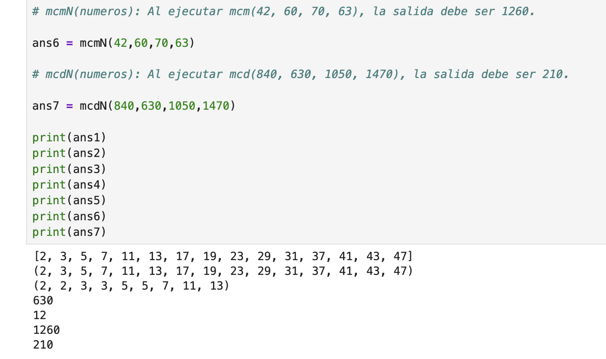

# Segunda tarea de APA 2023: Manejo de números primos

## Nom i Cognoms: Guillem Pérez Sánchez

## Fichero `primos.py`

- El alumno debe escribir el fichero `primos.py` que incorporará distintas funciones relacionadas con el manejo
  de los números primos.

- El fichero debe incluir una cadena de documentación que incluirá el nombre del alumno y los tests unitarios
  de las funciones incluidas.

- Cada función deberá incluir su propia cadena de documentación que indicará el cometido de la función, los
  argumentos de la misma y la salida proporcionada.

- Se valorará lo pythónico de la solución; en concreto, su claridad y sencillez, y el uso de los estándares marcados
  por PEP-8. También se valorará su eficiencia computacional.

### Determinación de la *primalidad* y descomposición de un número en factores primos

Incluya en el fichero `primos.py` las tres funciones siguientes:

- `esPrimo(numero)`   Devuelve `True` si su argumento es primo, y `False` si no lo es.
- `primos(numero)`    Devuelve una **tupla** con todos los números primos menores que su argumento.
- `descompon(numero)` Devuelve una **tupla** con la descomposición en factores primos de su argumento.

### Obtención del mínimo común múltiplo y el máximo común divisor

Usando las tres funciones del apartado anterior (y cualquier otra que considere conveniente añadir), escriba otras
dos que calculen el máximo común divisor y el mínimo común múltiplo de sus argumentos:

- `mcm(numero1, numero2)`:  Devuelve el mínimo común múltiplo de sus argumentos.
- `mcd(numero1, numero2)`:  Devuelve el máximo común divisor de sus argumentos.

Estas dos funciones deben cumplir las condiciones siguientes:

- Aunque se trate de una solución sub-óptima, en ambos casos deberá partirse de la descomposición en factores
  primos de los argumentos usando las funciones del apartado anterior.

- Aunque también sea sub-óptimo desde el punto de vista de la programación, ninguna de las dos funciones puede
  depender de la otra; cada una debe programarse por separado.

### Obtención del mínimo común múltiplo y el máximo común divisor para un número arbitrario de argumentos

Escriba las funciones `mcmN()` y `mcdN()`, que calculan el mínimo común múltiplo y el máximo común divisor para un
número arbitrario de argumentos:

- `mcm(*numeros)`:  Devuelve el mínimo común múltiplo de sus argumentos.
- `mcd(*numeros)`:  Devuelve el máximo común divisor de sus argumentos.

### Tests unitarios

La cadena de documentación del fichero debe incluir los tests unitarios de las cinco funciones. En concreto, deberán
comprobarse las siguientes condiciones:

- `esPrimo(numero)`:  Al ejecutar `[ numero for numero in range(2, 50) if esPrimo(numero) ]`, la salida debe ser
                      `[2, 3, 5, 7, 11, 13, 17, 19, 23, 29, 31, 37, 41, 43, 47]`.
- `primos(numeor)`: Al ejecutar `primos(50)`, la salida debe ser `(2, 3, 5, 7, 11, 13, 17, 19, 23, 29, 31, 37, 41, 43, 47)`.
- `descompon(numero)`: Al ejecutar `descompon(36 * 175 * 143)`, la salida debe ser `(2, 2, 3, 3, 5, 5, 7, 11, 13)`.
- `mcm(num1, num2)`: Al ejecutar `mcm(90, 14)`, la salida debe ser `630`.
- `mcd(num1, num2)`: Al ejecutar `mcd(924, 780)`, la salida debe ser `12`.
- `mcmN(numeros)`: Al ejecutar `mcm(42, 60, 70, 63)`, la salida debe ser `1260`.
- `mcdN(numeros)`: Al ejecutar `mcd(840, 630, 1050, 1470)`, la salida debe ser `210`.

### Entrega

#### Ejecución de los tests unitarios

Inserte a continuación una captura de pantalla que muestre el resultado de ejecutar el fichero `primos.py` con la opción
*verbosa*, de manera que se muestre el resultado de la ejecución de los tests unitarios.



#### Código desarrollado

Inserte a continuación el contenido del fichero `primos.py` usando los comandos necesarios para que se realice el
realce sintáctico en Python del mismo.

```python
# primos.py
# Guillem Perez Sanchez QP 2024-25

# APA-T2: Manejo de numeros primos

# Determinación de la primalidad y descomposición de un número en factores primos

def esPrimo(numero):
    # Devuelve True si su argumento es primo, y False si no lo es.
    if numero <= 1:
        return False
    for i in range(2, int(numero**0.5) + 1):
        if numero % i == 0:
            return False
    return True

def primos(numero): 
    # Devuelve una tupla con todos los números primos menores que su argumento.
    resultado=[]
    for i in range(1,numero-1):
        if esPrimo(i):
            resultado.append(i)
    return tuple(resultado)

def descompon(numero):
    # Devuelve una tupla con la descomposición en factores primos de su argumento.
    resultado = []
    divisor = 2
    while numero > 1:
        if numero % divisor == 0:  # Si es divisible, es un factor primo.
            resultado.append(divisor)
            numero //= divisor  # Divide el número por el divisor.
        else:
            divisor += 1  # Prueba con el siguiente divisor.
    return tuple(resultado)

# Obtención del mínimo común múltiplo y el máximo común divisor

"""
Estas dos funciones deben cumplir las condiciones siguientes:
- Aunque se trate de una solución sub-óptima, en ambos casos 
  deberá partirse de la descomposición en factores primos de 
  los argumentos usando las funciones del apartado anterior.
- Aunque también sea sub-óptimo desde el punto de vista de la 
  programación, ninguna de las dos funciones puede depender de 
  la otra; cada una debe programarse por separado.
"""

def mcm(numero1, numero2): 
    # Devuelve el mínimo común múltiplo de sus argumentos.
    mayor = max(numero1, numero2)  # Empezamos con el mayor de los dos números
    while True:
        if mayor % numero1 == 0 and mayor % numero2 == 0:
            return mayor
        mayor += 1

def mcd(numero1, numero2): 
    # Devuelve el máximo común divisor de sus argumentos.
    while numero2 != 0:
        numero1, numero2 = numero2, numero1 % numero2
    return numero1

# Obtención del mínimo común múltiplo y el máximo común divisor para un número arbitrario de argumentos

def mcmN(*numeros): 
    # Devuelve el mínimo común múltiplo de sus argumentos.
    resultado = 1
    for num in numeros:
        resultado = mcm(resultado,num)
    return resultado

def mcdN(*numeros): 
    # Devuelve el máximo común divisor de sus argumentos.  
    resultado = numeros[0]  # Inicializamos con el primer número
    for num in numeros[1:]:  # Iteramos desde el segundo número en adelante
        resultado = mcd(resultado, num)
    return resultado

# TESTS

# esPrimo(numero): Al ejecutar [ numero for numero in range(2, 50) if esPrimo(numero) ], la salida debe ser [2, 3, 5, 7, 11, 13, 17, 19, 23, 29, 31, 37, 41, 43, 47].

ans1 = [ numero for numero in range(2, 50) if esPrimo(numero) ]

# primos(numeor): Al ejecutar primos(50), la salida debe ser (2, 3, 5, 7, 11, 13, 17, 19, 23, 29, 31, 37, 41, 43, 47).

ans2 = primos(50)

# descompon(numero): Al ejecutar descompon(36 * 175 * 143), la salida debe ser (2, 2, 3, 3, 5, 5, 7, 11, 13).

ans3 = descompon(36 * 175 * 143)

# mcm(num1, num2): Al ejecutar mcm(90, 14), la salida debe ser 630.

ans4 = mcm(90,14)

# mcd(num1, num2): Al ejecutar mcd(924, 780), la salida debe ser 12.

ans5 = mcd(924,780)

# mcmN(numeros): Al ejecutar mcm(42, 60, 70, 63), la salida debe ser 1260.

ans6 = mcmN(42,60,70,63)

# mcdN(numeros): Al ejecutar mcd(840, 630, 1050, 1470), la salida debe ser 210.

ans7 = mcdN(840,630,1050,1470)

print(ans1)
print(ans2)
print(ans3)
print(ans4)
print(ans5)
print(ans6)
print(ans7)
```

#### Subida del resultado al repositorio GitHub ¿y *pull-request*?

El fichero `primos.py`, la imagen con la ejecución de los tests unitarios y este mismo fichero, `README.md`, deberán
subirse al repositorio GitHub mediante la orden `git push`. Si los profesores de la asignatura consiguen montar el
sistema a tiempo, la entrega se formalizará realizando un *pull-request* al propietario del repositorio original.

El fichero `README.md` deberá respetar las reglas de los ficheros Markdown y visualizarse correctamente en el repositorio,
incluyendo la imagen con la ejecución de los tests unitarios y el realce sintáctico del código fuente insertado.
